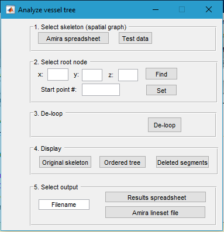
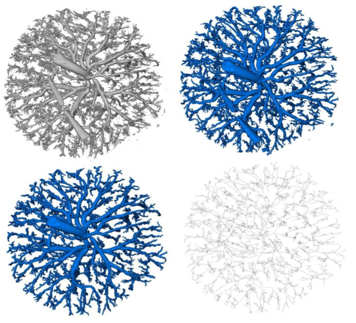
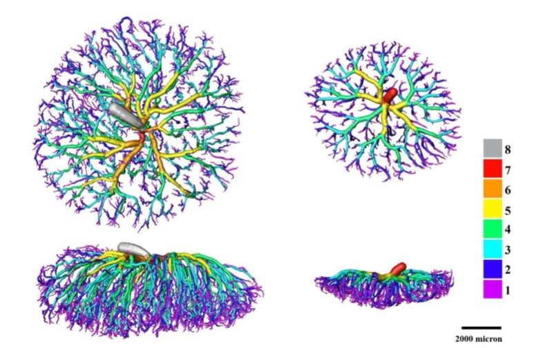
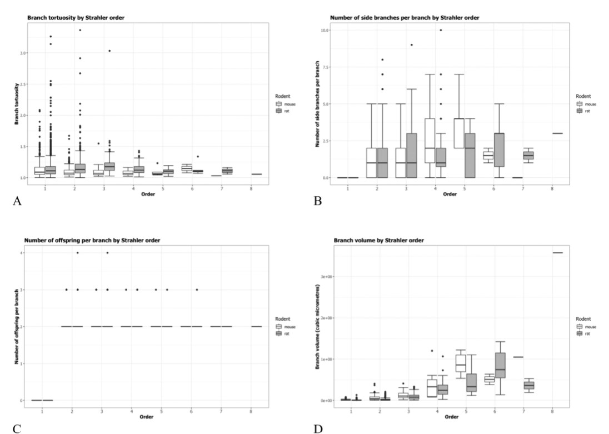

# Analyze-vessel-tree
This is the code for paper: 

[_Quantitative characterization of rodent feto-placental vasculature morphology in micro-computed tomography images_](https://www.sciencedirect.com/science/article/pii/S0169260719303293)

You may launch this project by [code/interface.p](./code/interface.p)  and you will get this:

  

  
  
Intput data can be lineset file or nrrd file generated by amira, Segmentation and skeleton extraction for the rat data.From top-left to bottom-right: Volume rendering of the original CT data.

  
  
  Volume renderings of the feto-placental arterial vascular trees for the rat (left) and the mouse (right) with branches color-coded according to Strahler order. Each rendering was generated from the corresponding skeleton by rendering a sphere at each point with a radius reflecting the vessel thickness and a color representing the Strahler order. Scalebar = 2000μm
    
  This project can also characterise the Strahler Ordered vessel tree in branch length, radius, tortuosity and bifurcation. Below is an example.
  
  
  
  Boxplots of several feto-placental vascular features by Strahler order in the rat versus the mouse:(A) branch tortuosity,(B) number of side branches per branch,(C) number of offspring per branch and (D) branch volume.
